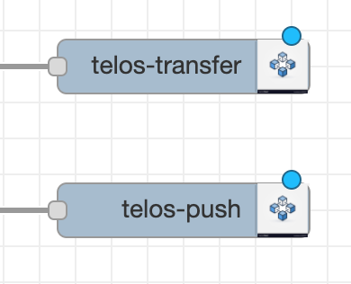

# Telos Node-Red NPM Package

Telos is a public eosio blockchain run by independent people around the world. This repository is for the development of a node-red NPM module that connects data to the blockchain.

Here you will find the javascript and HTML code for the "telos-transfer" node as well as the "telos-push" in a future version.

## Direct Usage

After downloading this repository, you will need to install the project dependencies. This can be done with:

```
npm install
```

You should see a package-lock.json file and a folder called node_modules that includes eosjs libraries for interacting with the blockchain.
